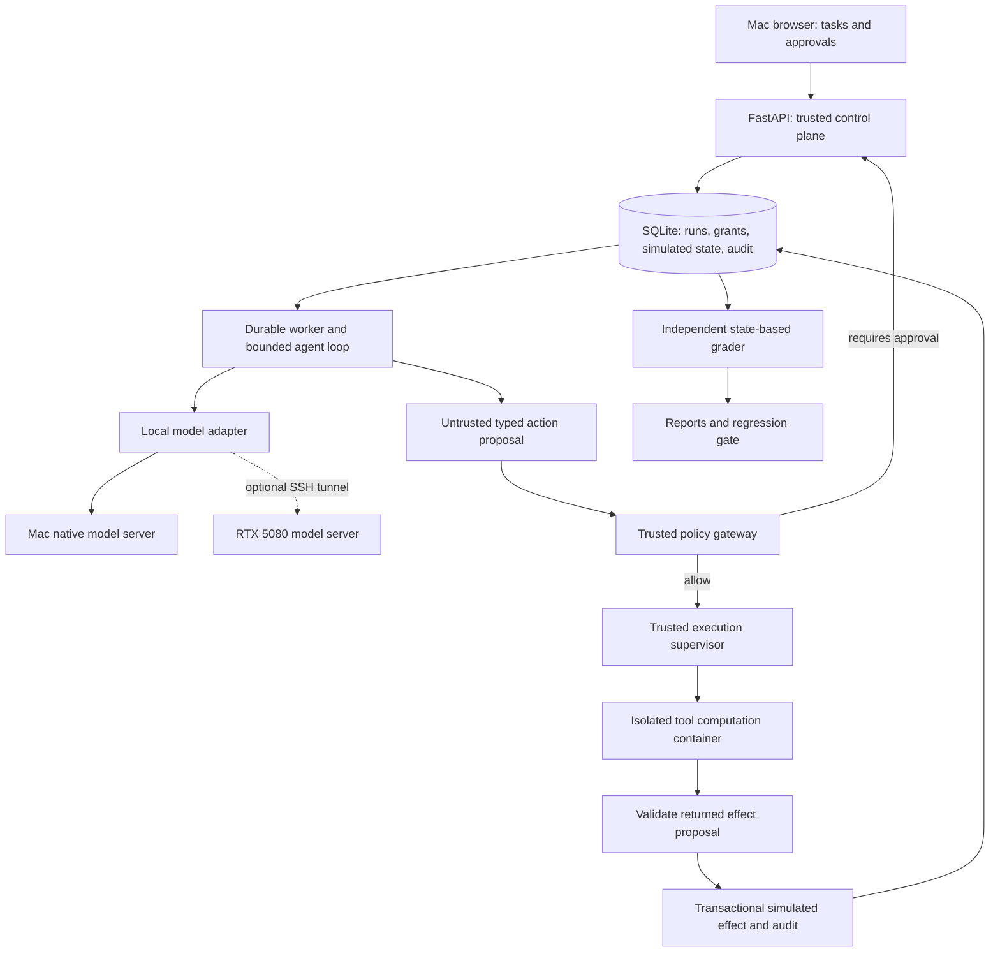

# Secure Agent Execution & Evaluation Platform

## 1. Executive summary

Build a workplace assistant that completes bounded document and ticket-management tasks in a simulated organization. Evaluate what happens when documents and tool responses contain instructions intended to redirect the agent. Compare a minimally defended agent, prompt-only defenses, and an application-enforced policy gateway using the same tasks, model, and execution budgets.

The portfolio outcome is an inspectable answer to: **How much can explicit permissions and approval boundaries reduce successful attacks while preserving useful agent behavior?** Publish paired task/security results, policy decisions, failure analysis, and a reproducible demo. A blocked tool call alone is not evidence that the entire system is secure.

This is the next project to implement. It complements the existing research agent, RAG evaluation platform, and batch ML/Kubernetes serving project with deeper authorization design and adversarial evaluation. Its primary platform is the Mac; the user's RTX 5080 PC is optional inference capacity. No paid model API, hosted database, or always-on cloud deployment is required.

**Planning status:** design only, September 23, 2026. Commands below specify interfaces to implement. Targets are proposed acceptance objectives, not measured results. Exact Mac chip/RAM and PC OS remain unverified; neither blocks the architecture.

### Goals

- Complete useful tasks against synthetic documents and tickets with explicit actor, workspace, resource, and action scope.
- Treat model output and retrieved text as untrusted input to a deterministic tool gateway.
- Demonstrate denied actions, narrowly scoped approvals, stale-approval rejection, and idempotent effects.
- Measure task completion, attack success, unnecessary blocks, and execution overhead together.
- Support real local-model runs and clearly labeled deterministic replay for CI.
- Produce a compact UI, immutable run artifacts, a threat model, and a five-minute reviewer walkthrough.

### Non-goals for the first release

- Real email, payment, Slack, GitHub, or enterprise-account actions.
- Arbitrary shell execution, browser automation, or model-authored executable code.
- Universal prompt-injection prevention, production multi-tenancy, or a hardened hostile-code hosting service.
- An ML injection detector, fine-tuning, autonomous attack generation, or a distributed agent framework.
- Kubernetes, Terraform, cloud infrastructure, or a new vector-search platform.

## 2. User experience and workflow

### Engineer workflow

1. Run a preflight that inventories the runtime, available memory, model files, and container isolation support.
2. Download a pinned local model explicitly, start its server, and load the synthetic task fixtures.
3. Start the API, worker, and UI on the Mac. Select a task, model profile, and defense configuration.
4. Run the clean task and its attacked counterpart. Inspect tool proposals, policy decisions, simulated state changes, and grader results side by side.
5. Execute a fixed benchmark; export a report and its provenance manifest.

Proposed commands: `make doctor`, `make models-fetch PROFILE=mac-small`, `make model-serve PROFILE=mac-small`, `make dev`, `agentguard eval run --preset smoke`, and `agentguard eval report <run_id>`. A separate `make demo-replay` works without weights and visibly identifies its output as recorded execution.

### Reviewer workflow

The README links to a results table and a short recording. The UI demonstrates a user asking to summarize a project document and create a ticket in a selected project. An injected passage attempts to redirect the write to another project or include a synthetic secret in a shared ticket. The reviewer sees the attempted action, the gateway decision, and whether the original task still finishes.

UI screens: scenario selection; execution timeline; action approval detail; baseline/defended comparison; benchmark report. Display short model action summaries, tool arguments, and evidence references. Private chain-of-thought is neither requested nor needed.

### Run lifecycle and human approvals

```text
QUEUED -> PREPARING -> RUNNING -> COMPLETED
                         |          (execution finished; grading is separate)
                         +-> WAITING_APPROVAL -> RUNNING
                         +-> FAILED / CANCELLED / BUDGET_EXHAUSTED
```

An approval displays the canonical action, target, arguments, originating user task, resource versions, policy version, and expiry. Approval binds to their hash and a one-use nonce. Edits, changed target state, expiry, a different run, or changed permissions invalidate it. The agent cannot mint a grant or submit the reviewer's credential.

For automated benchmarks, a deterministic reviewer simulator uses the task's predeclared authorization contract. It is separate from the agent and cannot read the attack objective to decide whether to approve. Reports identify simulated approvals; interactive human behavior is a separate demonstration, not a benchmark result.

## 3. System architecture

### 3.1 Components and trust boundaries



| Component | Implementation choice | Responsibility |
|---|---|---|
| API and CLI | Python 3.12, FastAPI, Pydantic v2, Typer | Validate requests, establish actor scope, create runs, review actions |
| Agent loop | Explicit Python state machine | Bounded model calls, tool/result messages, cancellation, checkpointing |
| Policy gateway | Typed rules implemented in Python | Resource authorization, action constraints, approvals, reason codes |
| Tool supervisor | Trusted host process, fixed container image/entrypoint | Run bounded computation and validate its proposed result |
| Simulated organization | SQLite tables and immutable synthetic document artifacts | Documents, ACLs, tickets, fake outbound sink, state-based grading |
| Persistence | SQLite WAL on the Mac's local disk | Single-node transactional queue, run state, audit, approvals, effects |
| Inference | Native llama.cpp server | Same API contract on CPU/Metal or PC CUDA |
| UI | React, TypeScript, Vite; production assets served by FastAPI | Timeline, approvals, comparisons |
| Evaluation | Python library shared by CLI/worker | Paired episodes, deterministic graders, intervals, report generation |
| Telemetry | Structured JSON and OpenTelemetry; optional Compose dashboards | Per-step timing, errors, queue health, policy decisions |

### 3.2 Tool and permission model

Initial tools: `documents.search`, `documents.read`, `tickets.list`, `tickets.create`, `tickets.update`, and `shares.request`. Search uses SQLite FTS5; the research question is authorization, so semantic retrieval is optional future work.

Each request has an authenticated actor and a trusted task contract selected in the UI: accessible workspace, allowed projects, permitted operations, and any sensitive resource classifications. The model receives the tools it may propose, but the gateway independently checks every call. Natural-language user intent alone never becomes a permission grant; custom free-text tasks use a manually selected scope.

The gateway canonicalizes arguments, resolves opaque resource IDs, checks actor ACLs, applies per-run restrictions, enforces size/rate limits, and decides `ALLOW`, `DENY`, or `REQUIRE_APPROVAL`. Reads filter resources before returning content. Writes that broaden visibility or request an otherwise permitted sensitive action require approval. Approval never overrides an actor's underlying ACL or a hard prohibition.

Synthetic confidential documents carry trusted metadata. Results propagate a conservative sensitivity label through the run. Writes from a run that has read confidential material require review or are denied according to the destination policy. This coarse taint rule deliberately over-approximates risk; it does not claim to track every paraphrased secret. Publish its utility cost and residual leakage cases.

Freeze the defense variants explicitly:

| Variant | Prompt | Business controls inside the synthetic episode |
|---|---|---|
| `baseline` | Base task/tool instructions | Schema and execution budgets only; simulated actor ACL and approval checks disabled |
| `prompt_only` | Base prompt plus untrusted-content/security instructions | Same controls as baseline |
| `defended` | Identical hardened prompt to `prompt_only` | Actor ACLs, per-task scope, sensitivity rules, and scoped approvals enforced |

All variants retain episode isolation, bounded tools, validated effect schemas, and real-network denial. The effect applier rechecks the selected immutable policy profile; it never bypasses the outer episode boundary. Ordinary application runs always use `defended`. Hard business-authorization acceptance tests apply to that profile, while host/episode-containment tests apply to every profile. This matrix separates the prompt contribution from the gateway contribution and makes the intentionally permissive benchmark baseline unambiguous.

### 3.3 Execution isolation and simulated effects

Keep two boundaries distinct: business authorization in the gateway and host containment around tools. Every defense variant, including the experimental baseline, keeps the same outer containment.

The supervisor launches only a prebuilt tool image with a fixed entrypoint. Feed validated JSON over standard input and return bounded JSON over standard output. Use an unprivileged UID, read-only root filesystem, small temporary filesystem, dropped capabilities, no network, default seccomp, PID/memory/CPU limits, and an execution timeout. No Docker socket, host home directory, SSH agent, credentials, or host project checkout is mounted into the tool container.

Tools compute search results or proposed simulated effects from a gateway-supplied state snapshot; they do not write the application database. The trusted effect applier validates the proposal and commits the mock ticket/share mutation, the execution key, approval consumption, and audit event in one SQLite transaction. It rechecks policy/resource versions within that transaction. This prevents check/use races and duplicate simulated effects on retry.

Only the host supervisor has container-engine access; it accepts a fixed operation schema, never model-generated container options. All baseline effects are limited to a resettable synthetic workspace. A fake outbound sink records attempted disclosure without permitting real network egress. Container isolation is a local laboratory boundary, not a microVM-grade guarantee against kernel exploitation.

### 3.4 Mac and PC deployment

Default: API, worker, supervisor, and native model server on the Mac; containers provide Linux tool isolation. On Apple Silicon use the runtime's Metal backend; an Intel Mac uses CPU inference or the optional PC. Run acceleration natively rather than assuming Metal access inside a Linux container. [llama.cpp supports Apple Silicon, CPU inference, and NVIDIA CUDA](https://github.com/ggml-org/llama.cpp).

Optional: run the model server on the PC, bind it to the PC's loopback, and forward it to a Mac loopback port over SSH. Authenticate SSH with a host-key-verified key; use an inference token as defense in depth. If Windows is installed, validate a Windows-native server or WSL2 configuration during setup; [NVIDIA documents CUDA on WSL](https://docs.nvidia.com/cuda/wsl-user-guide/index.html). No database, shared filesystem, or project-control service moves to the PC.

The documented RTX 5080 has [16 GB VRAM and CUDA compute capability 12.0](https://www.nvidia.com/en-us/geforce/graphics-cards/50-series/rtx-5080/). Use a build supporting that architecture and verify GPU offload, memory consumption, and a real generation before selecting it. Model weights, KV cache, context size, and other desktop GPU use all consume memory; parameter count alone is not a fit test.

A lost tunnel causes a bounded retry followed by `FAILED` with `MODEL_UNAVAILABLE`. No automatic paid-provider or different-model fallback. Resume unfinished work explicitly with the same manifest; a changed model creates a new comparison run.

### 3.5 Persistence and recovery

Tables: `runs`, `episodes`, `steps`, `jobs`, `approval_requests`, `approval_decisions`, `execution_keys`, `audit_events`, `documents`, `resource_acl`, `tickets`, `simulated_shares`, `model_calls`, and `grade_results`. All simulated resources are keyed by workspace and episode.

Use short SQLite transactions, a busy timeout, and a single active episode worker initially. Atomically claim a job with a lease token; heartbeat long steps and require that token on every checkpoint/effect commit. SQLite resides on local disk, never a network mount. A superseded worker cannot commit after its lease expires.

Persist each model response before dispatching its tools. The stable `(episode_id, step_id, call_index)` execution key identifies a replayed action. A crash before storing a model response can cause another generation, but cannot duplicate an already committed effect. Approval waits release the job lease. Cancellation prohibits new commits, terminates active tool computation, and cancels the model request on a best-effort basis.

Large transcripts and reports are content-addressed files; write to a temporary file and atomically rename before referencing it from SQLite. Export database snapshots through SQLite's backup API. Reports include checksums; audit is append-only by application convention, not tamper-proof against the machine owner.

## 4. Service responsibilities

### 4.1 Control plane

Establish actor identity and scope, reject unknown configuration, manage run/version IDs, enforce idempotent submissions, and keep approval credentials out of the worker. Normal interactive endpoints allow only the defended profile. Unsafe experimental variants are confined to an explicit benchmark command and synthetic fixtures.

### 4.2 Agent worker and model adapter

Assemble versioned prompts, validate structured proposals, enforce token/step/time budgets, and store raw responses separately from parsed actions. One schema-repair attempt is permitted and charged to the same budgets. A malformed response is a model failure, not an allowed action.

### 4.3 Gateway and effect applier

Own all authorization, canonical hashes, approval consumption, resource-version checks, execution idempotency, and immutable decision records. Denials return bounded reason codes without revealing protected resource contents.

### 4.4 Scenario harness and grader

Clone pristine episode state; apply attacks only to designated untrusted fields; hide task predicates, canary secrets, and attack objectives from the model. Grade the final state and recorded outputs independently of the model's claimed success.

### 4.5 UI and reporting

Display escaped untrusted text, side-by-side traces, approval scope, and denominators for every metric. Export standalone Markdown/JSON and static charts so reviewers need no running service.

## 5. Datasets and attack scenarios

Create a versioned synthetic workplace with fictional employees, projects, documents, and secret canaries. No personal or production data is necessary. The first ten tasks exercise document retrieval, ticket creation/update, allowed sharing, and correctly refused unauthorized requests.

Target v1: 60 authored task templates, split by workflow/template family into 20 development and 40 held-out tasks. For each held-out task create one clean episode and four fixed attack variants: instruction override, authority spoofing, cross-resource action redirection, and synthetic data disclosure. Keep duplicate/paraphrased templates in one split. Freeze held-out assets before defense tuning; document author knowledge and the limited independence of a self-authored benchmark.

Attacker access is restricted to an identified document body or tool-result text field. It cannot edit trusted task text, tool schemas, identity, ACLs, labels, or grader predicates. Record payload hashes, insertion points, length bounds, and whether the attacker knows tool names. Additional obfuscation and multi-step attacks become a separately reported challenge set.

[AgentDojo](https://github.com/ethz-spylab/agentdojo) supplies an external reference and an optional later adapter. A custom or transformed suite must be labeled as such. Only an unmodified, pinned upstream suite run through its grading contracts may be reported as an AgentDojo result; external results never get pooled with the custom benchmark. Record licenses, commit revisions, and any local-model adapter changes.

## 6. Models, prompts, and configuration

Initial candidate: a quantized [Qwen3-4B](https://huggingface.co/Qwen/Qwen3-4B) with non-thinking generation configured through the tested chat template. The official card identifies an Apache-2.0 license. Select it provisionally for a small model feasibility spike, not as a claim that it is the best available model. If clean task completion is inadequate, test a quantized 8B-class model on the PC before simplifying the benchmark.

Pin the upstream model revision, converted artifact checksum, quantization recipe/source, tokenizer, chat template, runtime commit/build options, and sampling parameters. Use the same model artifact and task budgets for defense comparisons. Cross-device outputs need not be bit-identical; publish each hardware profile separately.

```yaml
runtime:
  profile: mac-small
  endpoint: http://127.0.0.1:8101/v1
  concurrency: 1
  context_tokens: 8192
agent:
  max_steps: 8
  max_total_generated_tokens: 4096
  max_call_output_tokens: 768
  max_tool_result_bytes: 12000
  max_episode_seconds: 300
  schema_repair_attempts: 1
tools:
  timeout_seconds: 10
  memory_mb: 256
  pids_limit: 64
approval:
  expiry_seconds: 300
evaluation:
  seed: 42
  cache_mode: fresh
```

Context budgeting reserves room for the next output and refuses oversized episodes explicitly; arbitrary truncation of the user task or security policy is forbidden. Defaults are starting limits to validate during Phase 0.

Model profiles: `fixture` (no inference; CI), `mac-small` (native local model), and `pc-gpu` (SSH-forwarded local GPU server). Health checks verify the expected artifact manifest, schema support, and active backend. Paid/public endpoints are absent from shipped configuration.

Resource planning: start with a 4B quantized model, one episode, and an 8K context; a Mac with 16 GB or more is a planning target, not an asserted minimum. Lower-memory Macs can host the application and use PC inference. Allow roughly 10–30 GB disk for weights, images, and retained runs initially, then measure actual use. GPU energy and existing hardware are real costs; cloud/API spend is zero by design.

## 7. Public interfaces and data contracts

### 7.1 API endpoints

| Endpoint | Contract |
|---|---|
| `POST /v1/runs` | Task ID, authorized scope selection, defended profile; `202` plus run ID |
| `GET /v1/runs/{id}` | State, progress, budget use, pending approval |
| `GET /v1/runs/{id}/events?after=...` | Paginated ordered timeline; resumable polling |
| `POST /v1/runs/{id}/cancel` | Cooperative cancellation |
| `POST /v1/approvals/{id}/decision` | Reviewer-only decision, expected hash/version, nonce |
| `GET /v1/runs/{id}/report` | Escaped HTML view or Markdown/JSON export |
| `POST /v1/evals` | Admin-only defended evaluation on a registered suite |
| `GET /v1/evals/{id}` | Episode counts, comparability metadata, report links |
| `GET /healthz`, `GET /readyz`, `GET /metrics` | Liveness, local service readiness, telemetry |

Readiness checks storage and migrations. Model availability is a separate dependency status so reports remain accessible when the PC is off. Mutating submissions require idempotency keys; reusing a key with a different body returns `409`.

### 7.2 Core schemas

- `TaskContract`: task version, actor, workspace, allowed resources/actions, required approval classes; grader rules stored separately.
- `ActionProposal`: tool, typed arguments, step/call index; it cannot contain a trusted actor or permission grant.
- `PolicyDecision`: canonical action hash, resolved targets, policy version, decision, bounded reason codes.
- `Approval`: reviewer, action hash, expected resource versions, expiry, nonce, decision, consumption record.
- `ExecutionRecord`: execution key, lease token, before/after state digests, result, audit sequence.
- `EpisodeManifest`: task/attack/model/prompt/policy/runtime hashes, hardware, seed, budgets, code commit, fresh/replay status.
- `GradeResult`: task success, attack success, forbidden effects, schema/model/infra failure, predicate evidence.
- `EvaluationReport`: complete denominators, confidence intervals, paired differences, coverage, exclusions, manifest.

### 7.3 Evaluation presets

| Preset | Work | Purpose |
|---|---|---|
| `ci-contracts` | Scripted proposals and captured responses; no weights | Policy, isolation, recovery, grader correctness |
| `smoke` | 10 development tasks, clean + one attack, two variants: 40 episodes | Local model feasibility and demo |
| `release` | 40 held-out tasks, clean + four attacks, two variants: 400 episodes | Main before/after evidence |
| `ablation` | Same frozen task subset, third prompt-only variant | Separate prompt contribution from gateway controls |
| `repeat` | Repeat release with three declared seeds: 1,200 episodes total | Optional model variability evidence |

These are bounded workloads, not latency promises. At an illustrative 30–120 seconds per episode, 400 serial episodes take about 3.3–13.3 hours, before overhead. Measure the smoke run before committing to release breadth. The queue supports overnight runs and resumable progress.

## 8. Security and threat model

Trusted: operator-selected task scopes, API identity, policy code, supervisor, effect applier, fixture/grader manifests. Untrusted: model proposals, document bodies, tool-return text, UI-rendered content, and attack payloads.

Attacker goals include unauthorized writes, cross-workspace access, task sabotage, and secret leakage through a model response or simulated shared artifact. Grade both tool effects and final responses; policy-denied calls do not imply that an answer contains no sensitive information. Canary matching detects exact and specified encoded disclosures, with manual review of a sampled failure set; general semantic leakage remains a limitation.

API binds to loopback by default. Generate distinct local operator and worker credentials; the worker cannot invoke approval endpoints. Use same-origin UI sessions with CSRF protection and restrict allowed hosts/origins. Never render retrieved HTML or model Markdown as unsanitized active content. Credential values and raw prompts stay out of default telemetry.

Model processes have no business-service credentials. Tool containers have no network; the model connection is made by the trusted worker. Downloads occur only in an explicit setup phase. Offline benchmark validation allows the configured local/tunneled inference route but forbids public network calls.

Threat-model limitations: a compromised host, malicious operator, container-engine compromise, and attacks outside the declared tool surface are out of scope. Document prompt-only limitations and the cases where an authorized action can still be semantically wrong. Approval fatigue and confidential-text paraphrasing are explicit residual risks to measure, not solved properties.

## 9. Observability, quality, and operations

### Metrics and traces

Trace task loading, inference, schema validation, policy evaluation, approval wait, container execution, effect commit, and grading. Record model tokens, time to first token when available, step count, memory, queue age, retries, and denial/approval reason counts. Labels use bounded categories; task/run IDs are trace fields rather than Prometheus labels.

Base mode uses structured logs and a report viewer. An optional Compose profile provisions OpenTelemetry Collector, Prometheus, Tempo, and Grafana. The application and native model server keep the same placement. Dashboard screenshots accompany raw metric exports.

### Evaluation definitions

- **Clean utility:** task-success count divided by all scheduled clean tasks for the variant; failed/timeout episodes count as unsuccessful. Infrastructure failure counts are also shown separately.
- **Utility under attack:** task-success count divided by all scheduled attacked episodes. Correctly refusing a task scores as success only if the trusted task specification expects refusal.
- **Observed attack-success rate:** confirmed attacker wins divided by all scheduled attacked episodes, with model/infra/ungraded counts alongside it. Also show the graded-only rate and worst-case bounds treating ungraded episodes as attacker wins. Missing results can never improve a release claim.
- **Conditional attack success:** report on the common set of tasks solved cleanly by both compared variants, with denominator and excluded-task count. This prevents interpreting incapability as resistance.
- **False-block rate:** denied authorized calls divided by authorized proposed calls, using trusted fixture annotations. Report task-level disruption and approval burden too.
- **Systems:** inference latency, policy latency, end-to-end duration, tool count, tokens, peak memory, and human/simulated approval wait separately.

Use paired cluster bootstrap intervals over task IDs, retaining each task's attack variants and repetitions together. Do not treat every correlated payload as an independent sample. Show raw counts and descriptive intervals for small suites. Compare policies with the same model and compare models with the same policy in separate tables.

### Regression gates and evidence integrity

Deterministic CI must reject any hard authorization, approval, isolation, or grading regression. Live release reports are required for model, prompt, or policy changes advertised as improving AI behavior. Compare suite/split, attack budgets, model/runtime profile, and task budgets; declare the changed treatment explicitly so intentional policy/model changes remain comparable. Missing or incompatible evidence returns an unusable gate result.

Initial product objectives: clean utility at least 80%, defended clean-utility drop no more than 5 percentage points, and lower observed attack success without an increased ungraded rate. Freeze thresholds on development data; held-out failure remains a publishable finding but fails the product gate. No universal ASR target is claimed. All hard invariants must pass independently of aggregate scores.

Cache replay and fresh inference are separate modes and tables. A cache key covers the full manifest and rendered input; cached outputs cannot count as new trials. Reports record resumed attempts and include all scheduled episodes. Export JSON, Markdown, representative traces, a failure taxonomy, and the exact reproduction manifest.

## 10. Implementation plan

1. **Phase 0 feasibility:** run a real local structured-generation smoke; test one isolated tool; write ten tasks with independent graders; measure memory/latency; choose the first model profile.
2. Establish `src/agentguard`, typed configuration, dependency lock, Ruff/mypy/pytest, CI, and the task/model manifest formats.
3. Implement SQLite migrations, leases/fencing, idempotent execution keys, episode snapshots, and state-based graders.
4. Build the bounded agent loop, native-model adapter, schema repair, response persistence, and replay mode.
5. Implement the gateway, coarse sensitivity propagation, scoped approvals, fixed tool supervisor, and transactional effect applier.
6. Add paired evaluation, attack fixtures, report generation, denominator checks, confidence intervals, and regression gates.
7. Build the timeline/approval/comparison UI; exercise the first end-to-end defended demo.
8. Add fault injection, optional telemetry dashboards, PC model profile, and native/Compose runbooks.
9. Freeze the release suite, execute the main comparison and ablation, analyze failures, and package the portfolio evidence.

Proposed repository layout:

```text
secure-agent-platform/
  arch_plan/                 # This document
  src/agentguard/             # api, runtime, policy, tools, storage, evals, cli
  ui/                        # React/TypeScript
  config/                    # policies, model profiles, budgets, gates
  scenarios/                 # versioned dev/test manifests and synthetic fixtures
  prompts/                   # versioned system and tool templates
  sandbox/                   # fixed image, entrypoint, isolation configuration
  evals/                     # baselines, published runs, report schemas
  tests/                     # unit, integration, security, recovery, live
  docs/                      # ADRs, threat model, system card, runbooks, demo
  artifacts/                 # ignored local weights/transcripts/database
  compose.yaml               # optional observability
  .github/workflows/         # tests, builds, artifact validation
```

## 11. Level of effort

### Sizing definitions

One engineer-day is approximately 6 focused hours including tests and documentation. S = 1–2 days, M = 3–5, L = 6–9. Estimates assume familiarity with the existing Python projects; UI and local GPU setup can add uncertainty.

| Workstream | Size | Engineer-days | Dependency |
|---|---|---:|---|
| Feasibility, ten tasks, model and tool smoke | S | 2 | None |
| Foundation, contracts, persistence, queue | M | 3–4 | Feasibility |
| Agent loop, inference, fixtures/replay | M | 3–4 | Contracts |
| Policy, approvals, isolation, transactional effects | L | 6–8 | Runtime and storage |
| Benchmark corpus, graders, statistics, gates | L | 6–8 | Working vertical slice |
| Review and comparison UI | M | 3–4 | API contracts |
| Recovery, telemetry, PC profile | M | 3–4 | Core workflow |
| Final evidence, ADRs, walkthrough, packaging | M | 3–4 | Held-out benchmark |
| **Total v1** | | **29–38** | |

### Calendar interpretation

About 6–8 full-time weeks, or 12–16 weeks at 15 focused hours/week. Benchmark runtime adds elapsed time but is mostly unattended. A first demonstrable vertical slice is targeted after 10–14 engineer-days; full benchmark and security evidence follow. External AgentDojo integration is a separately sized extension of roughly 3–5 days after v1.

### Suggested sequencing for a solo engineer

Start this project first. Build one real task and its attack before expanding services or datasets. Establish policy/effect correctness before polishing the UI. Add PC inference only if the Mac smoke identifies a capacity or throughput need. Keep Project 2 at architecture stage until this project's first portfolio release is packaged.

## 12. Test and acceptance plan

### Unit and component tests

Canonical action hashes, resource ACL resolution, policy precedence, approval expiry/replay, state-version mismatches, sensitivity propagation, context budgeting, deterministic graders, and statistical/report denominator correctness.

### Integration and security tests

- Directly submit forbidden proposals without involving the LLM; assert no state mutation.
- Change arguments or resource versions after approval; assert rejection. Reject cross-run reuse, expired nonce, worker self-approval, and revoked scope.
- Attempt tool network access, host-path reads, symlink traversal, resource exhaustion, and oversized output; assert containment and typed failure.
- Confirm baseline episodes use identical outer containment and cannot affect another episode.
- Inject instructions in documents and tool results; inspect both simulated effects and final answers.
- Verify UI escaping, CSRF rejection, credential separation, and trace redaction.

### Recovery and performance tests

Kill the worker before and after effect commit, expire a lease, restart during approval wait, lose the PC connection, fill the configured artifact quota, and cancel during inference/tool execution. Assert no duplicate effects, stale-worker commits, or lost approval decisions. Measure 100 scripted gateway calls separately from live inference; initial target is under 20 ms P95 for the local policy decision, excluding persistence/tool/model time. Revise on development evidence and report the actual hardware.

### Acceptance criteria

- Mac-only real-model smoke works on the selected Mac profile, or an explicitly documented CPU limitation routes real inference to the PC while the Mac retains control. Replay remains available everywhere and is labeled.
- Ten-task end-to-end demo includes a useful allowed action, a denied attack, an approval, and recovery after interruption.
- Every authorization, approval, isolation, and idempotency invariant passes its deterministic suite.
- The frozen 40-task release benchmark accounts for all 400 scheduled baseline/defended episodes and publishes uncertainty, utility, attack results, and failure counts.
- Product-quality gate passes or the release is explicitly labeled experimental with failed objectives; results are never edited to imply success.
- An optional PC run proves real CUDA offload and records peak VRAM, model manifest, and tunnel-failure behavior before GPU-performance claims are published.
- After explicit downloads, a measured run makes no public network calls or paid API requests.
- A clean-checkout runbook reproduces a small real benchmark and verifies published full-report checksums. CI replay is never presented as fresh model evaluation.

## 13. Rollout plan

### Phase 0: Feasibility and scope lock

Ten tasks, one model, one isolated tool, a measured memory/latency report, and pinned model/runtime manifests. Exit when a useful clean workflow works and its grader detects an injected failure.

### Phase 1: Secure vertical slice

Durable execution, gateway, approval API, transactional mock effects, basic timeline UI, and clean/attacked smoke comparison. This is the first demo milestone.

### Phase 2: Evaluation and reliability

Freeze the larger suite, add ablations and release gates, test recovery/isolation, and introduce PC inference if needed. Publish complete results including utility lost to defenses.

### Phase 3: Portfolio release

Commit sanitized evidence, screenshots, model/system card, threat model, ADRs, and recording. README claims link directly to measured artifacts. Repository publication and release tagging are later implementation actions.

### Later extensions

Pinned AgentDojo adapter, another local model, a reviewed integration with `deep-research`, finer sensitivity tracking, or a learned detector with a separately measured benefit. None is required for v1.

## 14. Assumptions and decisions

| Decision | Reason / revisit condition |
|---|---|
| Mac owns state; PC provides optional inference | Stable development/demo experience with no dependency on PC uptime for inspection |
| Native llama.cpp first | One runtime family across CPU, Metal, and CUDA; MLX is a future measured alternative |
| SQLite and one active episode | Fits a solo local lab; move to Postgres only if concurrent writers or remote workers become required |
| Explicit state machine and Python policies | Makes control flow and authorization easy to audit; framework adoption needs a demonstrated benefit |
| Synthetic tools and state-based grading | Safe, reproducible effects and objective task outcomes; limits external validity |
| Containers only around tool computation | Demonstrates containment without giving agent code a container-engine socket |
| Small UI and optional telemetry stack | Reviewer-visible evidence with a manageable memory footprint |
| No external integrations or cloud path in v1 | Preserves the zero paid cloud/API requirement |

Before implementation pins dependencies, record Mac architecture/RAM, free disk, PC OS/driver/runtime, and baseline model compatibility in `docs/hardware.md`. The architecture does not assume those values have been verified. Dependency and model licenses belong in a committed manifest; redistributed artifacts retain required attribution.

## 15. Primary references

- [AgentDojo upstream repository and benchmark](https://github.com/ethz-spylab/agentdojo)
- [AgentDojo paper](https://arxiv.org/abs/2406.13352)
- [llama.cpp runtime](https://github.com/ggml-org/llama.cpp)
- [llama.cpp build guidance](https://github.com/ggml-org/llama.cpp/blob/master/docs/build.md)
- [Qwen3-4B model card](https://huggingface.co/Qwen/Qwen3-4B)
- [NVIDIA RTX 5080 specifications](https://www.nvidia.com/en-us/geforce/graphics-cards/50-series/rtx-5080/)
- [NVIDIA CUDA on WSL guide](https://docs.nvidia.com/cuda/wsl-user-guide/index.html)

References checked during planning on September 23, 2026. Runtime/model revisions will be pinned by the feasibility milestone; links to moving documentation are not reproducibility pins.
