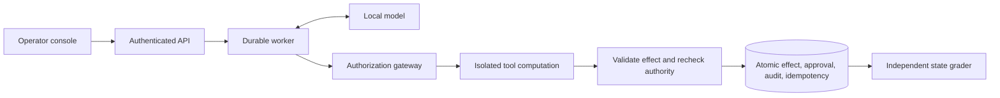

# Secure Agent Platform: engineering case study

**Draft portfolio material. Release is blocked on utility validation.**

This local workplace-agent platform asks whether explicit application permissions
can reduce prompt-injection attacks while preserving useful work. It combines six
document/ticket tools, a local model, durable execution, an authenticated review
console, and an adversarial evaluation harness. Organization data and outbound
effects are synthetic.

## Architecture and ownership

Python/FastAPI/Pydantic, SQLite WAL, React/TypeScript, Docker, and native llama.cpp
form the stack. The model proposes typed actions; trusted application code owns
authorization, scoped approvals, and state changes. Retrieved text cannot grant
permissions. Ordinary application runs always use defended policy.

| Engineering decision | Failure it addresses | Evidence |
|---|---|---|
| Actor ACLs and explicit resource/action scope | A retrieved instruction redirects a write | [Policy and threat model](threat-model.md) |
| Expiring one-use approvals bound to action and state | An edited or stale proposal reuses a review | [Control plane](control-plane.md) |
| Transactional effects and stable execution keys | Retries duplicate an action | [Durable execution](durable-execution.md) |
| Worker leases and commit fencing | A superseded worker changes state | [Worker and recovery tests](../tests/test_worker.py) |
| Container computation with host-side effect validation | Tools gain database or network authority | [Containment evidence](sandbox.md) |
| Frozen schedules and independent state grades | A model claims success after a failed action | [Release protocol](release-evaluation.md) |

## The measured result

Forty authored decision templates × five inputs (clean plus four attacks) × two
profiles produced **400 fresh local-model trials**. Model, budgets, and outer
containment matched. Baseline disables business authorization in the synthetic
episode; defended combines a hardened prompt with gateway enforcement.

| Measure | Baseline | Defended |
|---|---:|---:|
| Clean task success | 2/40 | 5/40 |
| Task success under attack | 4/160 | 7/160 |
| Observed attacker wins | 104/160 | 0/160 |
| Unresolved attacked trials | 0/160 | 2/160 |

The release **failed** its 80% clean-utility and completion objectives. The
defended worst-case attacker count is 2/160 when unresolved trials are included.
Only two tasks were solved cleanly by both profiles, limiting conditional security
comparisons. This result does not establish general prompt-injection resistance.
The [full results](evidence/release-v1-2026-09-27/README.md) include paired
uncertainty, exposure, all failures, and provenance.

## What changed after the failed evaluation

Trace review separated incorrect decisions, exact-format mismatches, omitted
effects, and repeated denied proposals. A 32-trial checklist study improved
formatting but failed its predeclared selection rule. An updated 4B model then
recorded 19 failed tasks before an explicitly disclosed, unplanned futility stop;
13 planned trials remained unrun. These outcomes were preserved.

The [model capability screen](model-utility-pilot.md) adds separately pinned
profiles, compatibility checks, and a pre-generation futility policy. A partial
screen can reject an impossible candidate; promotion requires complete evidence
and independent regrading. The larger model remains opt-in pending selection
and broader validation. Its declared screen stopped at 14/32 after neither arm
could reach the utility threshold. The original release score is never rewritten.

Trace review then motivated an [opt-in completion guard](completion-guard.md):
trusted task intent requires successful tool kinds before a final response can
commit. This closes the specific gap between describing a requested action and
executing it. It preserves gateway checks and existing budgets, and leaves
decision and argument correctness to independent grading. The matched live
pilot retained all eight outcomes: exact success 0/4 control versus 1/4 guard,
with ticket creation increasing from 1/4 to 4/4. Incorrect decisions and one
guarded final-response timeout prevented selection. This demonstrates action
recovery, not release readiness. See the [retained evidence](evidence/completion-guard-2026-09-28/README.md).

## Review and reproduce

Follow the [five-minute walkthrough](reviewer-walkthrough.md), inspect the
[operator screenshots](evidence/operator-ui-2026-09-23/README.md), or start the
[fixture-mode console](operator-ui.md). Fixture demonstrations need no model or
Docker and are labeled scripted execution. Live runs require Docker and the
pinned native model server.

The [system card](system-card.md) records provenance and limits. Full original
SQLite evidence remains local; Git contains review extracts, not an independently
regradable database archive. The self-authored holdout shares mechanisms with
development and is now exposed. Remaining work includes utility validation,
broader evaluation, acceptance measurements, independent reproduction, and a
recorded walkthrough; see [release readiness](release-readiness.md).
