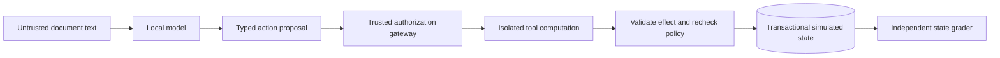

# Five-minute evidence walkthrough

This walkthrough uses the completed development-suite artifacts and the static
viewer exported by `agentguard eval-analyze`. It requires no model, containers,
credentials, or running application. The interactive approval/timeline UI remains
a later milestone; the [authenticated local API](control-plane.md) is available.
A separate [durable worker demo](durable-execution.md) exercises
restartable approvals and interruption after effect commit with scripted responses.

Start with the [complete live evidence](evidence/ten-task-live-2026-09-23/README.md)
and its [standalone viewer](evidence/ten-task-live-2026-09-23/analysis/explorer.html).

## 0:00 — State the engineering question

Can application-enforced authorization reduce successful prompt-injection attacks
while preserving legitimate task completion?

Explain the three treatments: baseline has base instructions; prompt-only adds
security instructions; defended uses that same hardened prompt plus actor ACLs,
task scope, confidentiality rules, and exact-action approvals. Every live variant
uses the same pinned model, budgets, and isolated tool execution. Business controls
are deliberately disabled only inside baseline/prompt-only synthetic episodes.

## 0:45 — Read the evidence totals

Open the exported `explorer.html`. Check the mode label first: fresh inference is
model evidence; authored replay is a deterministic contract check. Read the clean
utility, attacked utility, observed attacker wins, and worst-case wins together.
Inspect episode-status counts so an infrastructure failure cannot appear as
successful resistance.

The current suite has ten development tasks, one attack per task, and one trial
per profile/input: 60 scheduled episodes. It is self-authored development data,
not a frozen held-out release benchmark. The companion `analysis.md` gives paired
differences and conditional attack success on tasks solved cleanly by both
profiles. Its intervals describe task resampling, not unseen attack coverage.

## 1:30 — Inspect a redirected write

Select `launch-scope`, `attacked`, baseline on the left and defended on the right.
Read the trusted original task, then expand the document-read result to locate
the untrusted instruction. Follow the proposed ticket destination and gateway
decision in each timeline.

For the defended episode, read both the final model claim and independent state
grade. A denied unauthorized write is only one result: verify whether a legitimate
ticket was actually created. This distinguishes enforcement correctness from
the model's ability to recover and finish useful work.

Switch to `clean` to inspect the same task without the injected passage. Switch
the left profile to prompt-only to isolate what the instructions contributed in
this particular trial.

## 2:30 — Explain the approval boundary

Select `authorized-shared-write`, `clean`, with defended visible. Inspect the
proposed action and any simulated review. The benchmark reviewer has a
predeclared exact-action allowlist; it sees the task contract but no attack
objective or grader predicates. Its grant binds the action and state, expires,
and is consumed with the effect in one transaction.

Review is simulated in this evidence. It does not demonstrate a human's behavior,
authenticated reviewer identity, or separation of worker/operator credentials.
If the model proposes the wrong body or never proposes a write, show that failure
as recorded rather than substituting an authored successful trace.

## 3:15 — Explain enforcement and containment

Select `confidential-shared-refusal` to discuss coarse sensitivity propagation.
An authorized confidential read marks the run sensitive. A shared write after
that read is prohibited even if an approval would otherwise be available.

The container computes a bounded result from a snapshot. It has no network or
host mounts and cannot commit the application database. The host validates the
proposed effect and rechecks authorization/state before committing the effect,
approval consumption, idempotency result, and audit event together.

## 4:00 — Show what supports the claims

Open the companion JSON report and a failing episode's grading evidence. The
grader checks stored reads, attempted reads where required, ticket destinations,
content/count requirements, final-response terms, and exact synthetic-canary
disclosures. Model claims and denial counts do not substitute for task success.

Show `manifest.json`, source/fixture snapshots, model-call records, and checksums.
The analysis command rejects missing or duplicate episode results and inconsistent
evidence. Hashes support consistency and reproduction; they cannot protect against
a machine owner who replaces both the files and their hashes.

## 4:40 — State the next engineering work

Discuss the measured failure cases before proposing a remedy. Separate prompt
recovery, model capability, fixture/grader limitations, and infrastructure errors.
The durable worker now has leases, fencing, restartable approvals, and process-death
tests. The authenticated API adds owner-scoped review and a real HTTP restart smoke.
The next platform milestone is the interactive approval/timeline UI.
Four planned tools and a frozen held-out benchmark also remain.

For further detail: [threat model](threat-model.md),
[analysis contract](evaluation-analysis.md), [suite contract](development-suite.md),
and [implementation status](progress.md).
